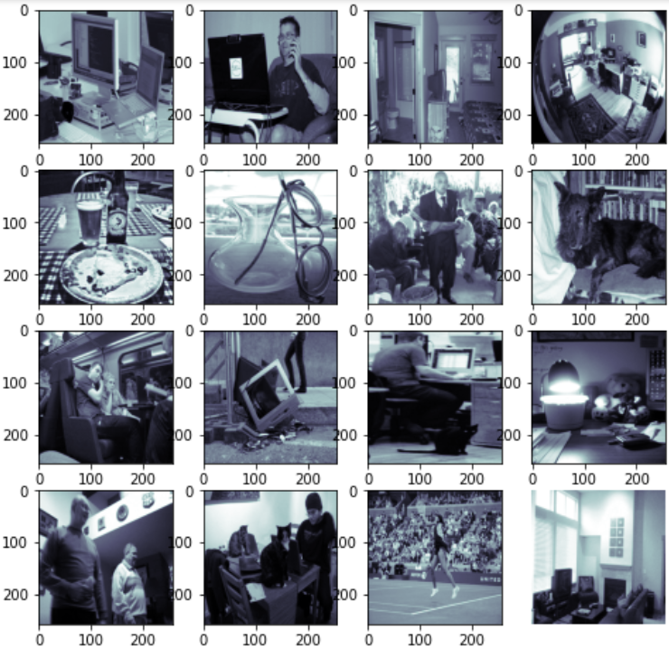

# Image Colorization Using Conditional Generative Adversarial Network
*  
*  
## Table of Contents:
* Overview of project
* CGAN and Model Architecture
* Data description
* Libraries used
* Steps followed
* Predictions at different Epochs
* Losses
## Overview of project
We will use CGAN based deep learning model to colorise black and white images.Goal is to implement and end-to-end deep learning pipeline to automate image colorisation.
## CGAN and Model Architecture
* GAN is a Generative Adversarial Network where two different model compete against one another.It involves Generator and Discrminator.Generator tries to give output which can fake the discriminator ability to predict it as fake not real.Generator is fed,a latent vector with some added noise as an input.In Condtional-GAN base architecture remains same i.e here also Generator and Discrminator with their adversarially learning behaviour.But in this, we add extra label y, which can be a vector or any image , while feeding to Generator and same label with generator output to Discrminator.For more detail info about CGAN visit
<a href='https://jonathan-hui.medium.com/gan-cgan-infogan-using-labels-to-improve-gan-8ba4de5f9c3d'>C-GAN</a>.
* Colorisation can be thought of as image to image translation and CGAN is perfect in realising this task,we feed a black and white image and get colorise output.For Generator Model ,we will be implementing modified U-net Architecture and in Discrminator we will be using PatchGAN discriminator ,rather than giving a single scalar value it gives output having matrix based output for each input.More detail about architecture can be found at <a href='https://arxiv.org/pdf/1611.07004.pdf'>PIX2PIX</a>
* Sample U-net
* 

## Data description
* We are using fastai api to download the 10000 image samples from COCO dataset. 
<pre>.
└── fastai api(COCO Dataset)   
     ├── train    
     │   └── ... (8000 sets of  images total)           
     └── test
         └── ... (2000 sets of  images total)</pre> 
      
* Steps:
1. !pip install -U fastai
2. from fastai.data import untar__data,URLS
3. coco_path = untar_data(URLs.COCO_SAMPLE)
4. coco_path = str(coco_path) + "/train_sample"
5. paths = glob.glob(path + "/*.jpg")
After running above instructions ,paths will contain all imagefile paths in a list.

* Color space
  * We have converted color space of image from RGB to LAB ,in RGB each channel specifies intensity of its corresponding color.But in LAB each channel has different   meaning .For achieving image translation we can use L channel as labels and feed it to Generator and make it predict 'AB' channel ,and final output is the concatenation of L channel and AB channel.

## Libraries used:
   * Numpy
   * Pandas
   * Matplotlib
   * Pytorch
   * PIL
   * skimage
 
## Steps followed
   1. Importing necessary libraries 
   2. Preparing DataLoader ,keep in mind that color space of image needs to be in LAB .
   3. Implementing Generator and PatchGAN Discriminator
   4. Defining  training part
   5. Code for visualizing output on validation set
   6. Code for model checkpoints,so that further model training start from previous state.
 ## Predictions at different Epochs
    1. Epochs=20(validation_data)

    2. Epochs=20(train_data)

    3. Epochs=80(validation_data)

    4. Epochs=80(train_data)

    5. Epochs=140(validation_data)

    6. Epochs=140(train_data)

   
    * With further training predictions can be imporved further.
## Losses

Every epoch involves 500 iteration, so 140 epochs aggregate 70000 iterations.Discriminator loss remains very low and Generator loss continues to drop with slow rate.

## Replication On Device

  
    
  
  

